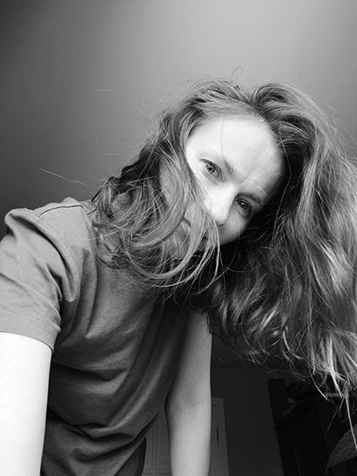

# **TATYANA USS**

> I hope you feel things you’ve never felt before. I hope you meet people who have a different point of view. I hope you live a life you’re proud of, and if you’re not, I hope you have the courage to start over again.  
*― F. Scott Fitzgerald*

---
## **PERSONAL INFORMATION**
---
### *__Date of birth__*  
15.11.1986
### *__Contacts__* 
Address: Minsk, Belarus  
E-mail: *usstatyanka@gmail.com*  
Discord: *tatyanka_u*

---
## **SKILLS**
---
### *__Languages__* 
* __Russian__ - Native
* __English__ - B1/B2

---
## **PROFILE**
---
I want to be a frontend developer. I have an analytical mind, which will certainly help me in my studies. I like to learn new things and improve my knowledge  

---
## **OBJECTIVE**
---
I want to obtain a position as a Junior Frontend Developer

---
## **EXPERIENCE**
---

---
## **EDUCATION**
---
*__2010-2015 Belarusian State Pedagogical Institute named after M. Tank__*
   
Specialty: Psychology  
*University Degree*

*__2004-2007 Belarusian State Academy of Arts__*  

Specialty: Design of interiors and small architectural forms  
*Incomplete University Degree (3 years)*